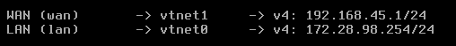
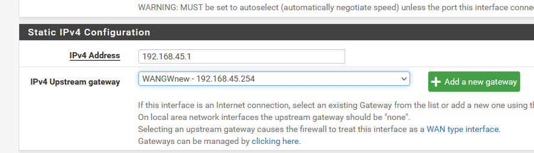
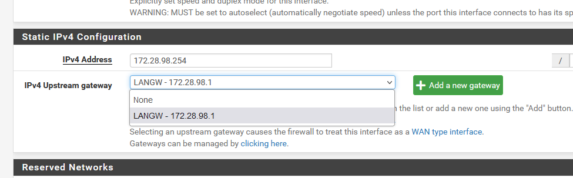
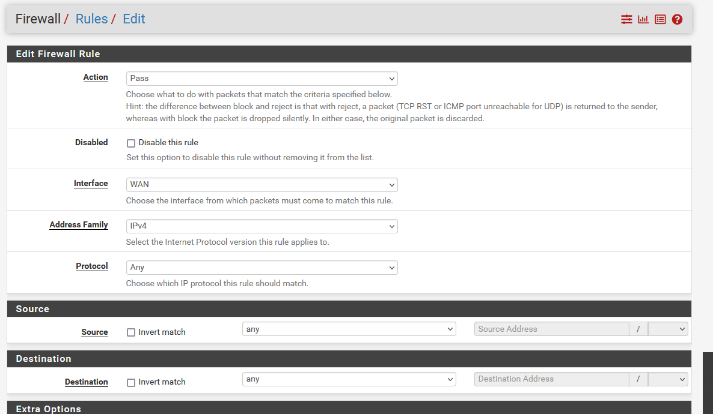

# Configuration du Firewall OPNsense

- Pour la configuration du pare-feu, le début est très simple : il suffit de lui attribuer 2 interfaces réseau, **`LAN`** **et** **`WAN`**;

**LAN** est l'entrée du pfSense. Si l'on se réfère au schéma, on doit lui attribuer l'adresse IP  **`172.28.98.254`**, et pour le **WAN**, l'adresse IP  **`192.168.45.1`**

 

# Configuration de la gateway pour le WAN et le LAN

- **WAN** on lui attrtibue la passerelle **`192.168.45.254`**, qui est le **LAN** du Stormshield, qui nous sert de porte de sortie  

- **LAN** on lui attribue la passerelle **`172.28.98.254`**

- Sur le firewall pfsense, on active la règle **`Pass`**, qui va permettre de tout laisser passer sur le réseau sans filtres.

