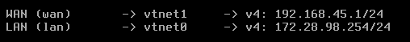

# Configuration du Firewall Pfsense

- Pour la configuration du firewall, le debut est tres simple il suffit de lui attribuer 2 interfaces réseau **`LAN`** **et** **`WAN`**;

- **LAN** est l'entrée du pfsense, si on se repère au schéma on doit lui attribuer **`172.28.98.254`**, et pour le **WAN** **`192.168.45.1`**
 

