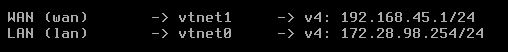

# Configuration du Firewall Pfsense

- Pour la configuration du pare-feu, le début est très simple : il suffit de lui attribuer 2 interfaces réseau, **`LAN`** **et** **`WAN`**;

**LAN** est l'entrée du pfSense. Si l'on se réfère au schéma, on doit lui attribuer l'adresse IP  **`172.28.98.254`**, et pour le **WAN**, l'adresse IP  **`192.168.45.1`**

