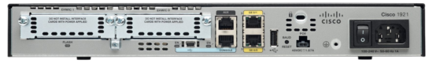

# Guide d'installation des routeurs cisco R1_ORL et R2_ORL

## Réinitialisation des routeurs

Les boutons des routeurs ne fonctionnaient plus, nous avons donc réinitialisés les routeurs à la ligne de commande.

1. Dès que les informations apparaissent à votre écran, appuyer sur les touches **CTRL+PAUSE** pour accéder au **ROM MONITOR MODE**
2. si **prompt>** apparaît à l'écran alors exécuter les commandes suivantes: **confreg 0x2142** et ensuite **reset**
3. Le routeur va redémarrer et demandera à faire le setup, écrivez **no**
4. Taper **enable** et exécuter la commande suivante: **Copy startup-config running-config**
5. Créer un mot de passe pour le mode privilege **Enable secret "mdp"** puis pour l'accès à la console **Password "mdp"**
6. Pour finir taper **confreg 2102** et **copy startup-config running-config**

## Installer SSH [**ici**](/switch.md)

## Adressage IP d'une interface d'un routeur cisco 

 

**Routeur R1_ORL**

1. Taper la commande **enable** puis **conf t**
3. Exécuter les commandes suivantes: **int g0/1** ; **ip address 183.44.145.2 255.255.255.252** ; Activer l'interface **no sh** puis quitter **exit**
2. Ensuite, **int g0/0.240** et **ip address 172.28.105.100 255.255.255.0** activer l'interface et quitter
3. Pareil avec une autre interface virtuelle: **int g0/0.249** ; **ip address 172.28.96.253 255.255.255.0** activer également l'interface et quitter
4. Activer la passerelle par défaut : **ip route 0.0.0.0 0.0.0.0 183.44.145.2**

**Routeur R2_ORL**

1. Taper la commande **enable** puis **conf t**
3. Exécuter les commandes suivantes: **int g0/1** ; **ip address 1 255.255.255.252** ; Activer l'interface **no sh** puis quitter **exit**
2. Ensuite, **int g0/0.240** et **ip address 172.28.96.200 255.255.255.0** activer l'interface et quitter
3. Pareil avec une autre interface virtuelle: **int g0/0.249** ; **ip address 172.28.105.252 255.255.255.0** activer également l'interface et quitter
4. Activer la passerelle par défaut : **ip route 0.0.0.0 0.0.0.0 221.87.145.**

