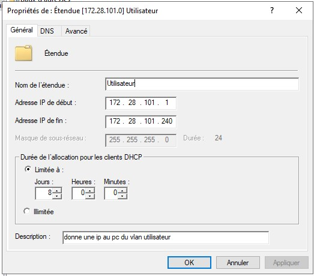

## Création serveur ORL_DC_01 vm nutanix:

Accéder au site nutanix via **`https://172.16.90.200:9440`**
 
Se connecter avec ses id du réseau SIO
 
Créer une vm et la nommer selon la convention du cahier des charges soit ORL_X.
 

 
On ajoute 2 cd-rom, un contenant l'ISO de windows, un contenant des pilotes nécessaires à Nutanix et un disk d'environ 50G.
 
On ajoute également 2 cartes réseaux sur les bons vlans (vlan 240 et 241 dans notre cas).
 

 
Cocher la case "Use this VM as an Agent VM" sur la page suivant et cliquer sur next.
 
Lancement de la Vm et installation de windows serveur de façon classique.
 
Changement du nom NetBios du serveur.
 
Mise en place d'IP fixe: sur l'ethernet1 "172.28.97.10 255.255.255.0" ethernet2 "172.28.96.10 255.255.255.0"
 
Ajout du rôle ADDS sur le serveur.
 

 
On promouvoit le serveur en contrôleur de domaine.
 
Notre domaine est "local.orleans.sportludique.fr".
 
On ajoute ensuite les rôles DNS et DHCP.
 
CONFIGURATION ETENDUE DHCP
 

