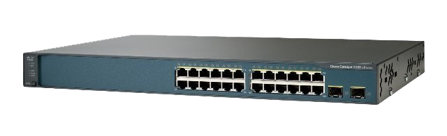

# Guide d'Installation de SSH et Création de VLAN sur un Switch Cisco

## Installation de SSH sur le Switch

1. **Connexion au Switch :** On se connecte au switch Cisco via le câble console en utilisant un client de terminal.

2. **Configuration SSH :**
    On a activé le service SSH (version 2) en utilisant les commandes suivantes :
    
    **`switch(config)# ip ssh version 2`** 
    
   **`switch(config)# line vty 04`**
    
   **`switch(config-line)# transport input ssh`**
    
   **`switch(config-line)# transport output ssh`**
    
   **`switch(config-line)# login local`**
    
   **`switch(config-line)# exit`**
    
   Il ne faut pas oublier d'entrer :
    
   **`copy running-config startup-config`**
    

   - De plus on a généré une paire de clés SSH RSA pour l'authentification avec la commande **`switch(config)# crypto key generate rsa`** puis ensuite vous entrez **`2048`**.

## Création de VLAN sur le Switch

3. **Configuration des VLANs :**
 
   - On accède au mode de configuration VLAN en conf-t.
   - Pour créer un VLAN il faut spécifier son numéro, pour créer notre vlan Management on utilise le vlan 240 et on lui donne un nom significatif : 
    
    **`switch(config)# int vlan 240`**
     
    **`switch(config-if)# no sh`**
     
    **`switch(config-if)# ex`**
     
    **`switch(config)#vlan 240`**
     
    **`switch(config-vlan)# name Management`**
   - On peut repéter ce processus pour créer d'autres VLANs si nécessaire.

4. **Attribution des Ports aux VLANs :**
   - On accéde au mode de configuration de l'interface du port qu'on souhaite attribuer à un VLAN pour notre part on va lui attribuer le port g0/1.
    
   **`switch(config)# int g0/1`**
    
   **`switch(config-if)# switchport mode access`**
    
   **`switch(config-if)# switchport access vlan 240`**

